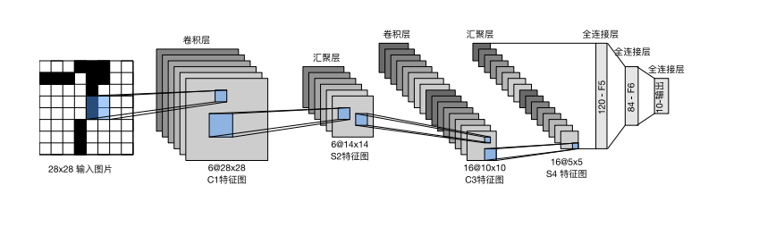
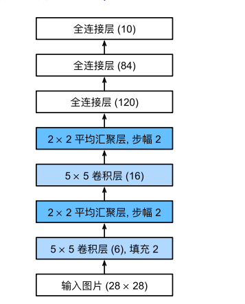
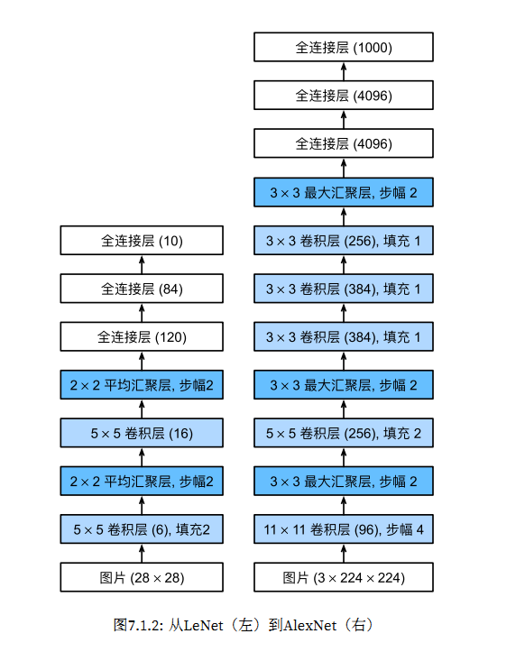
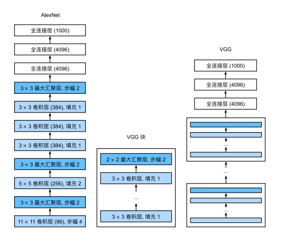
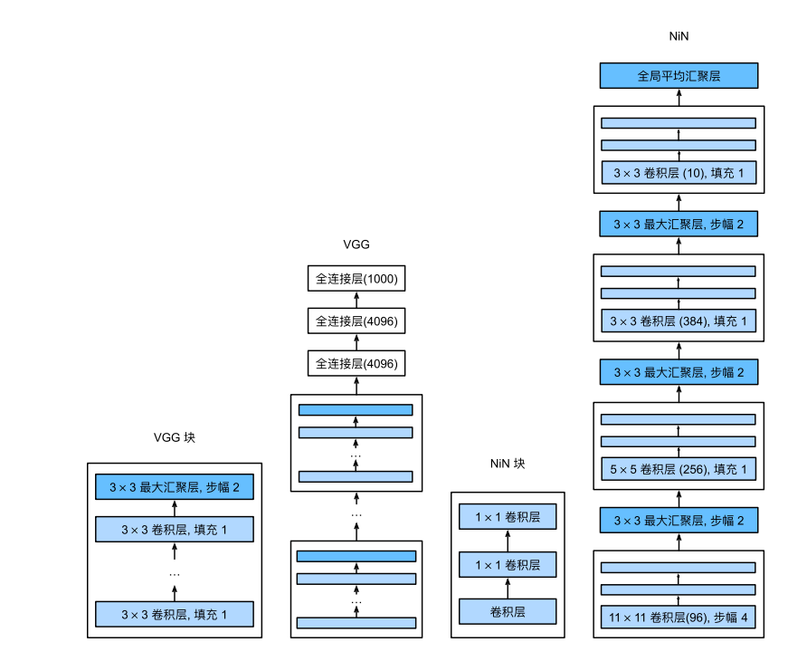
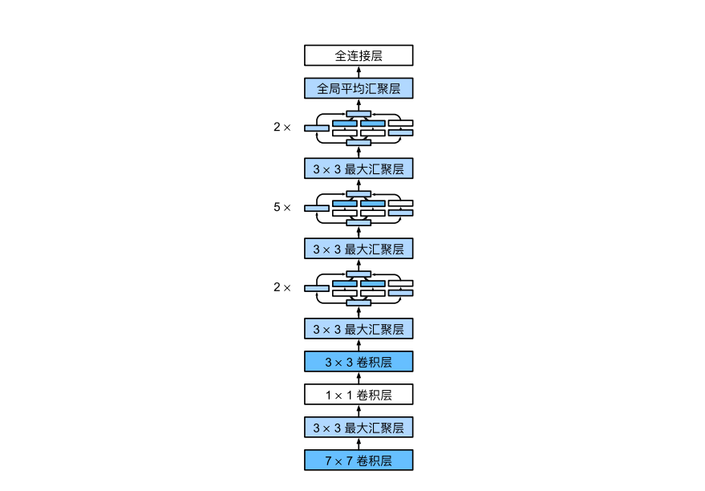
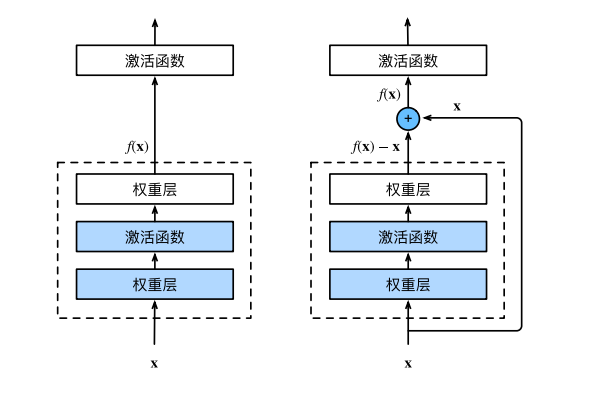
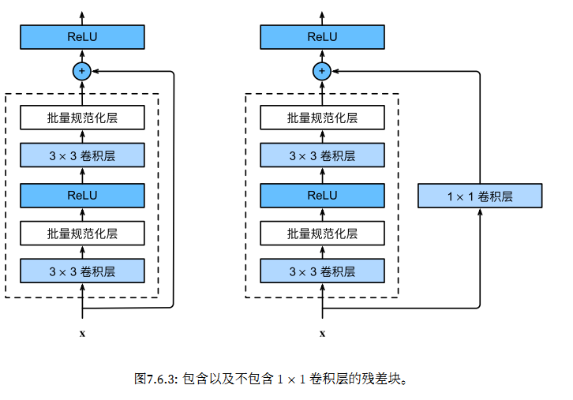
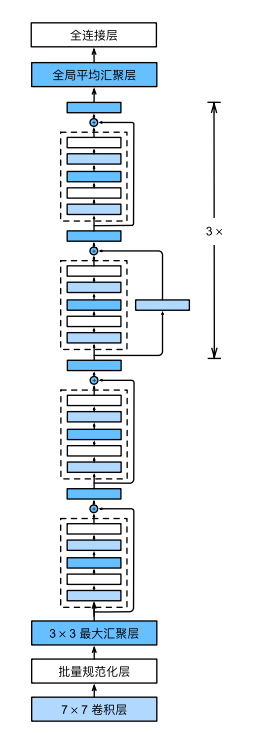
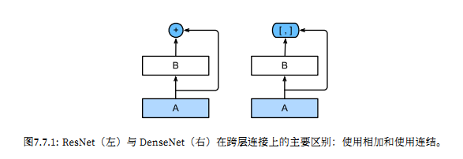

# 现代卷积网络

## LeNet

LeNet（LeNet-5）由两个部分组成：
• 卷积编码器：由两个卷积层组成;
• 全连接层密集块：由三个全连接层组成。

其架构为：

激活层为$sigmoid$,池化层为平均池化。

• 卷积神经⽹络（CNN）是⼀类使⽤卷积层的⽹络。
• 在卷积神经⽹络中，我们组合使⽤卷积层、⾮线性激活函数和汇聚层。
• 为了构造⾼性能的卷积神经⽹络，我们通常对卷积层进⾏排列，逐渐降低其表⽰的空间分辨率，同时增
加通道数。
• 在传统的卷积神经⽹络中，卷积块编码得到的表征在输出之前需由⼀个或多个全连接层进⾏处理。
• LeNet是最早发布的卷积神经⽹络之⼀。

## AlexNet

AlexNet：它是第⼀个在⼤规模视觉竞赛中击败传统计算机视觉模型的⼤型神经⽹络

AlexNet由⼋层组成：五个卷积层、两个全连接隐藏层和⼀个全连接输出层。AlexNet使⽤ReLU⽽不
是sigmoid作为其激活函数。

### 模型设计

在AlexNet的第⼀层，卷积窗⼝的形状是11×11。由于ImageNet中⼤多数图像的宽和⾼⽐MNIST图像的多10倍
以上，因此，需要⼀个更⼤的卷积窗⼝来捕获⽬标。第⼆层中的卷积窗口形状被缩减为5×5，然后是3×3。此
外，在第⼀层、第⼆层和第五层卷积层之后，加⼊窗⼝形状为3×3、步幅为2的最⼤汇聚层。⽽且，AlexNet的
卷积通道数⽬是LeNet的10倍。在最后⼀个卷积层后有两个全连接层，分别有4096个输出。

### 激活函数

AlexNet将sigmoid激活函数改为更简单的ReLU激活函数。⼀⽅⾯，ReLU激活函数的计算更简单，它不需要如sigmoid激活函数那般复杂的求幂运算。另⼀⽅⾯，当使⽤不同的参数初始化⽅法时，ReLU激活函数使训练模型更加容易。

### 容量控制和预处理

AlexNet通过暂退法控制全连接层的模型复杂度，⽽LeNet只使⽤了权重衰减。为了进⼀步扩充数据，AlexNet在训练时增加了⼤量的图像增强数据，如翻转、裁切和变⾊。这使得模型更健壮，更⼤的样本量有效地减少了过拟合。

AlexNet的Dropout放在全连接层一和二的后面

• AlexNet的架构与LeNet相似，但使⽤了更多的卷积层和更多的参数来拟合⼤规模的ImageNet数据集。
• 今天，AlexNet已经被更有效的架构所超越，但它是从浅层⽹络到深层⽹络的关键⼀步。
• 尽管AlexNet的代码只⽐LeNet多出⼏⾏，但学术界花了很多年才接受深度学习这⼀概念，并应⽤其出
⾊的实验结果。这也是由于缺乏有效的计算⼯具。
• Dropout、ReLU和预处理是提升计算机视觉任务性能的其他关键步骤。

## VGG

使⽤重复块的⽹络(VGG): 它利⽤许多重复的神经⽹络块

经典卷积神经⽹络的基本组成部分是下⾯的这个序列：

1. 带填充以保持分辨率的卷积层；
2. ⾮线性激活函数，如ReLU；
3. 汇聚层，如最⼤汇聚层。

### VGG块

⼀个VGG块与之类似，由⼀系列卷积层组成，后⾯再加上⽤于空间下采样的最⼤汇聚层。在最初的VGG论⽂中，作者使⽤了带有3×3卷积核、填充为1（保持⾼度和宽度）的卷积层，和带有2×2汇聚窗⼝、步幅为2（每个块后的分辨率减半）的最⼤汇聚层。

### VGG网络

VGG⽹络可以分为两部分：第⼀部分主要由卷积层和汇聚层组成，第⼆部分由全连接层组成。

VGG神经⽹络连接⼏个VGG块。其中有超参数变量conv_arch。该变量指定了每个VGG块⾥卷积层个数和输出通道数。全连接模块则与AlexNet中的相同。

• VGG-11使⽤可复⽤的卷积块构造⽹络。不同的VGG模型可通过每个块中卷积层数量和输出通道数量的差异来定义。
• 块的使⽤导致⽹络定义的⾮常简洁。使⽤块可以有效地设计复杂的⽹络。
• 在VGG论⽂中，Simonyan和Ziserman尝试了各种架构。特别是他们发现深层且窄的卷积（即3×3）⽐
较浅层且宽的卷积更有效（与感受野有关、参数少而感受野大）

## NIN

⽹络中的⽹络(NiN): 它重复使⽤由卷积层和1×1卷积层（⽤来代替全连接层）来构建深层⽹络。

LeNet、AlexNet和VGG都有⼀个共同的设计模式：通过⼀系列的卷积层与汇聚层来提取空间结构特征；然后通过全连接层对特征的表征进⾏处理。AlexNet和VGG对LeNet的改进主要在于如何扩⼤和加深这两个模块。或者，可以想象在这个过程的早期使⽤全连接层。然⽽，如果使⽤了全连接层，可能会完全放弃表征的空间结构。⽹络中的⽹络（NiN）提供了⼀个⾮常简单的解决⽅案：在每个像素的通道上分别使⽤多层感知机。

### NiN块

卷积层的输⼊和输出由四维张量组成，张量的每个轴分别对应样本、通道、⾼度和宽度。另外，全连接层的输⼊和输出通常是分别对应于样本和特征的⼆维张量。

NiN的想法是**在每个像素位置（针对每个⾼度和宽度）应⽤⼀个全连接层 **。如果我们将权重连接到每个空间位置，我们可以将其视为1×1卷积层或作为在每个像素位置上独⽴作⽤的全连接层。从另⼀个⻆度看，即将空间维度中的每个像素视为单个样本，将通道维度视为不同特征（feature）。

NiN块以⼀个普通卷积层开始，后⾯是两个1×1的卷积层。这两个1×1卷积层充当带有ReLU激活函数的逐像素全连接层。第⼀层的卷积窗⼝形状通常由⽤⼾设置。随后的卷积窗⼝形状固定为1×1。、

### NiN模型

NiN和AlexNet之间的⼀个显著区别是NiN完全取消了全连接层。相反，NiN使⽤⼀个NiN块，其输出通道数等于标签类别的数量。最后放⼀个全局平均汇聚层（global average pooling layer），⽣成⼀个对数⼏率。NiN设计的⼀个优点是，它显著减少了模型所需参数的数量。

• NiN使⽤由⼀个卷积层和多个1×1卷积层组成的块。该块可以在卷积神经⽹络中使⽤，以允许更多的每像素⾮线性。
• NiN去除了容易造成过拟合的全连接层，将它们替换为全局平均汇聚层（即在所有位置上进⾏求和）。该汇聚层通道数量为所需的输出数量（例如，Fashion-MNIST的输出为10）。
• 移除全连接层可减少过拟合，同时显著减少NiN的参数。
• NiN的设计影响了许多后续卷积神经⽹络的设计。

## GoogLeNet

含并⾏连结的⽹络(GoogLeNet): 它使⽤并⾏连结的⽹络，通过不同窗⼝⼤⼩的卷积层和最⼤汇聚层来并⾏抽取信息。

GoogLeNet吸收了NiN中串联⽹络的思想，并在此基础上做了改进，重点解决了什么样⼤⼩的卷积核最合适的问题。毕竟，以前流⾏的⽹络使⽤⼩到1×1，⼤到11×11的卷积核。本⽂的⼀个观点是，有时使⽤不同⼤⼩的卷积核组合是有利的。

### Inception块

Inception块由四条并⾏路径组成。前三条路径使⽤窗⼝⼤⼩为1×1、3×3和5×5的卷积层，从不同空间⼤⼩中提取信息。中间的两条路径在输⼊上执⾏1×1卷积，以减少通道数，从⽽降低模型的复杂性。第四条路径使⽤3×3最⼤汇聚层，然后使⽤1×1卷积层来改变通道数。这四条路径都使⽤合适的填充来使输⼊与输出的⾼和宽⼀致，最后我们将每条线路的输出在通道维度上连结，并构成Inception块的输出。在Inception块中，通常调整的超参数是每层输出通道数。

GoogLeNet有效的原因：⾸先滤波器（filter）的组合，它们可以⽤各种滤波器尺⼨探索图像，这意味着不同⼤⼩的滤波器可以有效地识别不同范围的图像细节。同时，我们可以为不同的滤波器分配不同数量的参数。

### GoogLeNet模型

GoogLeNet⼀共使⽤9个Inception块和全局平均汇聚层的堆叠来⽣成其估计值。Inception块之间的最⼤汇聚层可降低维度。第⼀个模块类似于AlexNet和LeNet，Inception块的组合从VGG继承，全局平均汇聚层避免了在最后使⽤全连接层。

• Inception块相当于⼀个有4条路径的⼦⽹络。它通过不同窗⼝形状的卷积层和最⼤汇聚层来并⾏抽取信息，并使⽤1×1卷积层减少每像素级别上的通道维数从⽽降低模型复杂度。
• GoogLeNet将多个设计精细的Inception块与其他层（卷积层、全连接层）串联起来。其中Inception块的通道数分配之⽐是在ImageNet数据集上通过⼤量的实验得来的。
• GoogLeNet和它的后继者们⼀度是ImageNet上最有效的模型之⼀：它以较低的计算复杂度提供了类似的测试精度。

## 批量规范化

批量规范化应⽤于单个可选层（也可以应⽤到所有层），其原理如下：在每次训练迭代中，⾸先规范化输⼊，即通过减去其均值并除以其标准差，其中两者均基于当前⼩批量处理。接下来，应⽤⽐例系数和⽐例偏移。正是由于这个基于批量统计的标准化，才有了批量规范化的名称。

### 原理

从形式上来说，用x∈B表示一个来自小批量$$B$$的输入，批量规范化$$BN$$根据以下表达式转换x:

$$\mathrm{BN}(\mathbf{x}) = \boldsymbol{\gamma} \odot \frac{\mathbf{x} - \hat{\boldsymbol{\mu}}_\mathcal{B}}{\hat{\boldsymbol{\sigma}}_\mathcal{B}} + \boldsymbol{\beta}.$$

$$\hat{\boldsymbol{\mu}}_\mathcal{B}$$是小批量$$\mathcal{B}$$的样本均值，$$\hat{\boldsymbol{\sigma}}_\mathcal{B}$$是小批量$$\mathcal{B}$$的样本标准差。应用标准化后，生成的小批量的平均值为0和单位方差为1。由于单位方差（与其他一些魔法数）是一个主观的选择，因此我们通常包含拉伸参数（scale）$$\boldsymbol{\gamma}$$和偏移参数（shift）$$\boldsymbol{\beta}$$，它们的形状与$$\mathbf{x}$$相同。
请注意，$$\boldsymbol{\gamma}$$和$$\boldsymbol{\beta}$$是需要与其他模型参数一起学习的参数。

由于在训练过程中，中间层的变化幅度不能过于剧烈，而批量规范化将每一层主动居中，并将它们重新调整为给定的平均值和大小（通过$$\hat{\boldsymbol{\mu}}_\mathcal{B}$$和$${\hat{\boldsymbol{\sigma}}_\mathcal{B}}$$）。

从形式上来看，我们计算出$$\hat{\boldsymbol{\mu}}_\mathcal{B}$$和$${\hat{\boldsymbol{\sigma}}_\mathcal{B}}$$，如下所示：

$$\begin{aligned} \hat{\boldsymbol{\mu}}_\mathcal{B} &= \frac{1}{|\mathcal{B}|} \sum_{\mathbf{x} \in \mathcal{B}} \mathbf{x}\\\hat{\boldsymbol{\sigma}}_\mathcal{B}^2 &= \frac{1}{|\mathcal{B}|} \sum_{\mathbf{x} \in \mathcal{B}} (\mathbf{x} - \hat{\boldsymbol{\mu}}_{\mathcal{B}})^2 + \epsilon.\end{aligned}$$

请注意，我们在方差估计值中添加一个小的常量$\epsilon > 0$，以确保我们永远不会尝试除以零，即使在经验方差估计值可能消失的情况下也是如此。估计值$$\hat{\boldsymbol{\mu}}_\mathcal{B}$$和$${\hat{\boldsymbol{\sigma}}_\mathcal{B}}$$通过使用平均值和方差的噪声（noise）估计来抵消缩放问题。
你可能会认为这种噪声是一个问题，而事实上它是有益的。

### 批量规范化层

#### 全连接层

通常，我们将批量规范化层置于全连接层中的仿射变换和激活函数之间。
设全连接层的输入为u，权重参数和偏置参数分别为$$\mathbf{W}$$和$$\mathbf{b}$$，激活函数为$$\phi$$，批量规范化的运算符为$$\mathrm{BN}$$。
那么，使用批量规范化的全连接层的输出的计算详情如下：

$$\mathbf{h} = \phi(\mathrm{BN}(\mathbf{W}\mathbf{x} + \mathbf{b}) ).$$

回想一下，均值和方差是在应用变换的"相同"小批量上计算的。

#### 卷积层

同样，对于卷积层，我们可以在卷积层之后和非线性激活函数之前应用批量规范化。当卷积有多个输出通道时，我们需要对这些通道的“每个”输出执行批量规范化，每个通道都有自己的拉伸（scale）和偏移（shift）参数，这两个参数都是标量。
假设我们的小批量包含$m$个样本，并且对于每个通道，卷积的输出具有高度$p$和宽度$q$。那么对于卷积层，我们在每个输出通道的$m \cdot p \cdot q$个元素上同时执行每个批量规范化。
因此，在计算平均值和方差时，我们会收集所有空间位置的值，然后在给定通道内应用相同的均值和方差，以便在每个空间位置对值进行规范化。

### 预测过程中的批量规范化

批量规范化在训练模式和预测模式下的行为通常不同。
首先，将训练好的模型用于预测时，我们不再需要样本均值中的噪声以及在微批次上估计每个小批次产生的样本方差了。其次，例如，我们可能需要使用我们的模型对逐个样本进行预测。
一种常用的方法是通过移动平均估算整个训练数据集的样本均值和方差，并在预测时使用它们得到确定的输出。
可见，和暂退法一样，批量规范化层在训练模式和预测模式下的计算结果也是不一样的。

- 在模型训练过程中，批量规范化利用小批量的均值和标准差，不断调整神经网络的中间输出，使整个神经网络各层的中间输出值更加稳定。
- 批量规范化在全连接层和卷积层的使用略有不同。
- 批量规范化层和暂退层一样，在训练模式和预测模式下计算不同。
- 批量规范化有许多有益的副作用，主要是正则化。另一方面，”减少内部协变量偏移“的原始动机似乎不是一个有效的解释。

## ResNet

残差⽹络(ResNet): 它通过残差块构建跨层的数据通道，是计算机视觉中最流⾏的体系架构。

### 残差块

左边为正常块，右边为残差块。

假设我们的原始输⼊为$$x$$，⽽希望学出的理想映射为$$f(x)$$（作为上⽅激活函数的输⼊）。左图虚线框中的部分需要直接拟合出该映射f(x)，⽽右图虚线框中的部分则需要拟合出残差映射$$f(x)- x$$。残差映射在现实中往往更容易优化。以本节开头提到的恒等映射作为我们希望学出的理想映射f(x)，我们只需将右图虚线框内上⽅的加权运算（如仿射）的权重和偏置参数设成0，那么f(x)即为恒等映射。实际中，当理想映射f(x)极接近于恒等映射时，残差映射也易于捕捉恒等映射的细微波动。右图是ResNet的基础架构‒残差块（residual block）。在残差块中，输⼊可通过跨层数据线路更快地向前传播。

**残差块架构 **:ResNet沿⽤了VGG完整的3×3卷积层设计。残差块⾥⾸先有2个有相同输出通道数的3  3卷积层。每个卷积层后接⼀个批量规范化层和ReLU激活函数。然后我们通过跨层数据通路，跳过这2个卷积运算，将输⼊直接
加在最后的ReLU激活函数前。这样的设计要求2个卷积层的输出与输⼊形状⼀样，从⽽使它们可以相加。如果想改变通道数，就需要引⼊⼀个额外的1×1卷积层来将输⼊变换成需要的形状后再做相加运算。

### Resent 模型

ResNet的前两层跟之前介绍的GoogLeNet中的⼀样：在输出通道数为64、步幅为2的7×7卷积层后，接步幅
为2的3×3的最⼤汇聚层。不同之处在于ResNet每个卷积层后增加了批量规范化层。

GoogLeNet在后⾯接了4个由Inception块组成的模块。ResNet则使⽤4个由残差块组成的模块，每个模块使⽤
若⼲个同样输出通道数的残差块。第⼀个模块的通道数同输⼊通道数⼀致。由于之前已经使⽤了步幅为2的
最⼤汇聚层，所以⽆须减⼩⾼和宽。之后的每个模块在第⼀个残差块⾥将上⼀个模块的通道数翻倍，并将⾼
和宽减半。

最后，与GoogLeNet⼀样，在ResNet中加⼊全局平均汇聚层，以及全连接层输出。

* 学习嵌套函数（nested function）是训练神经⽹络的理想情况。在深层神经⽹络中，学习另⼀层作为恒等映射（identity function）较容易（尽管这是⼀个极端情况）。
* 残差映射可以更容易地学习同⼀函数，例如将权重层中的参数近似为零。
* 利⽤残差块（residual blocks）可以训练出⼀个有效的深层神经⽹络：输⼊可以通过层间的残余连接更快地向前传播。
* 残差⽹络（ResNet）对随后的深层神经⽹络设计产⽣了深远影响。

## DenseNet

稠密连接⽹络(DenseNet):它的计算成本很⾼，但给我们带来了更好的效果。

## 从ResNet到DenseNet

任意函数的泰勒展开式，它把这个函数分解成越来越高阶的项。在$x$接近0时，

$$f(x) = f(0) + f'(0) x + \frac{f''(0)}{2!}  x^2 + \frac{f'''(0)}{3!}  x^3 + \ldots$$

同样，ResNet将函数展开为$$f(\mathbf{x}) = \mathbf{x} + g(\mathbf{x}).$$

也就是说，ResNet将$f$分解为两部分：一个简单的线性项和一个复杂的非线性项。那么再向前拓展一步，如果我们想将$f$拓展成超过两部分的信息呢？一种方案便是DenseNet。

ResNet和DenseNet的关键区别在于，DenseNet输出是*连接*（用图中的$[,]$表示）而不是如ResNet的简单相加。
因此，在应用越来越复杂的函数序列后，我们执行从$\mathbf{x}$到其展开式的映射：

$$\mathbf{x} \to \left[\mathbf{x},f_1(\mathbf{x}),f_2([\mathbf{x}, f_1(\mathbf{x})]), f_3([\mathbf{x}, f_1(\mathbf{x}), f_2([\mathbf{x}, f_1(\mathbf{x})])]), \ldots\right].$$

最后，将这些展开式结合到多层感知机中，再次减少特征的数量。

稠密网络主要由2部分构成：*稠密块*（dense block）和*过渡层*（transition layer）。前者定义如何连接输入和输出，而后者则控制通道数量，使其不会太复杂。

### 稠密块体

⼀个稠密块由多个卷积块组成，每个卷积块使⽤相同数量的输出通道。然⽽，在前向传播中，我们将每个卷
积块的输⼊和输出在通道维上连结。

### 过渡层

由于每个稠密块都会带来通道数的增加，使⽤过多则会过于复杂化模型。⽽过渡层可以⽤来控制模型复杂度。
它通过1×1卷积层来减⼩通道数，并使⽤步幅为2的平均汇聚层减半⾼和宽，从⽽进⼀步降低模型复杂度。

### DenseNet模型

• 在跨层连接上，不同于ResNet中将输⼊与输出相加，稠密连接⽹络（DenseNet）在通道维上连结输⼊与输出。
• DenseNet的主要构建模块是稠密块和过渡层。
• 在构建DenseNet时，我们需要通过添加过渡层来控制⽹络的维数，从⽽再次减少通道的数量。

