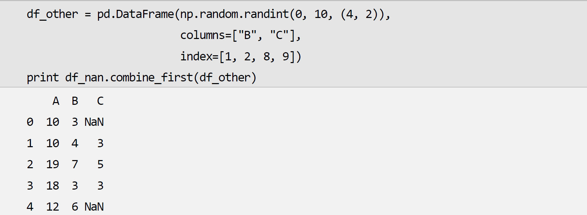

```python
import pandas as pd
pd.Series([],index=[])  # 创建Series类
Series.iteritems()      # 将Series的键值对展示出来、
# Series可以进行加法，进行加法时，index相同的相加，没有的话，为NAN，类型转换为float64
# "5"和5意义是不同的
```

```python
df_soil = pd.read_csv("data/Soils-simple.csv", index_col=[0, 1], parse_dates=["Date"])
#通过index_col参数指定第0和第1列为行索引，用parse_dates参数指定进行日期转换的列。在指定列时可以使用列的#序号或列名。
df_soil.dtypes  #获取各列的数据类型
#DataFrame对象拥有行索引和列索引，可以通过索引标签对其中的数据进行存取。index属性保存行索引，而columns属性保存列索引。在本例中列索引是一个Index对象，索引对象的名称可以通过其name属性存取；行索引是一个表示多级索引的MultiIndex对象，每级的索引名可以通过names属性存取。
df_soil.columns            #列索引
df_soil.columns.names      #列索引名
df_soil.index              #行索引
df_soil.index.names        #行索引名
#[]运算符可以通过列索引标签获取指定的列，当下标是单个标签时，所得到的是Series对象，例如df_soil["pH"]，而当下标是列表时，则得到一个新的DataFrame对象，例如df_soil[["Dens", "Ca"]]
# .loc[]可通过行索引标签获取指定的行
#values属性将DataFrame对象转换成数组，由于本例中的列类型不统一，所得到的数组是一个元素类型为object的数组。

```

将内存中的数据转换为DataFrame对象

调用DataFrame()可以将多种格式的数据转换成DataFrame对象，它的三个参数data、index和columns分别为数据、行索引和列索引。data参数可以是：

- 二维数组或者能转换为二维数组的嵌套列表。
- 字典：字典中的每对“键-值”将成为DataFrame对象的列。值可以是一维数组、列表或Series对象。

```python
pd.DataFrame(...,index=[],columns=[])
```

此外还可以调用以from_开头的类方法，将特定格式的数据转换成DataFrame对象。from_dict()将字典转换为DataFrame对象，其orient参数可以指定字典键对应的方向，默认值为"columns"，表示把字典的键转换为列索引，即字典中的每个值与一列对应。而orient参数为"index"时，字典中的每个值与一行对应。当字典为嵌套字典，即字典的值为字典时，另外一个轴的索引值由第二层字典中的键决定。下面分别将列表字典和嵌套字典转换为DataFrame对象。嵌套字典中缺失的数据使用NaN表示

```python
pd.DataFrame.from_dict(...,orient=)
#orient = "index"\"columns"
```

from_items()将“（键，值）”序列转换为DataFrame对象，其中“值”是表示一维数据的列表、数组或Series对象。当其orient参数为"index"时，需要通过columns指定列索引。

```python
pd.DataFrame.from_items(...,orient=...,columns=...)
```

to_dict()方法将DataFrame对象转换为字典，它的orient参数决定字典元素的类型：

```python
print df2.to_dict(orient="records") #字典列表
print df2.to_dict(orient="list") #列表字典
print df2.to_dict(orient="dict") #嵌套字典
"""
[{'a': 1, 'b': 4}, {'a': 2, 'b': 5}, {'a': 3, 'b': 6}]
{'a': [1, 2, 3], 'b': [4, 5, 6]}
{'a': {0: 1, 1: 2, 2: 3}, 'b': {0: 4, 1: 5, 2: 6}}
"""
```

to_records()方法可以将DataFrame对象转换为结构数组，若其index参数为True（默认值），则其返回的数组中包含行索引数据


## index对象

- Index.get_loc(value)：获得单个值value的下标。
- Index.get_indexer(values)：获得一组值values的下标，当值不存在时，得到-1。

可以直接调用Index()来创建Index对象，然后传递给DataFrame()的index或columns参数。由于Index是不可变对象，因此多个数据对象的索引可以是同一个Index对象。

```python
pd.Index([],names="")
```

## MultiIndex对象

MultiIndex表示多级索引，它从Index继承，其中的多级标签采用元组对象来表示。下面通过[]获取其中的单个元素，调用get_loc()和get_indexer()以获取单个标签和多个标签对应的下标。


常用的函数参数

| 参数名          | 常用值       | 说明                |
| ------------ | --------- | ----------------- |
| axis         | 0、1       | 运算对应的轴            |
| level        | 整数或索引的级别名 | 指定运算对应的级别         |
| fill_value   | 数值        | 指定运算中出现的NaN的替代填充值 |
| skipna       | 布尔值       | 运算是否跳过NaN         |
| index        | 序列        | 指定行索引             |
| columns      | 序列        | 指定列索引             |
| numeric_only | 布尔值       | 是否只针对数值进行运算       |
| func         | 可调用对象     | 指定回调函数            |
| inplace      | 布尔值       | 是否原地更新，若为否，则返回新对象 |
| encoding     | "utf8"    | 指定文本编码            |
| dropna       | 布尔值       | 是否删除包含NaN的行       |

DataFrame对象的各种存取方法

| 方法                               | 说明                                       |
| -------------------------------- | ---------------------------------------- |
| [col_label]                      | 以单个标签作为下标，获取与标签对应的列，返回Series对象           |
| [col_labels]                     | 以标签列表作为下标，获取对应的多个列，返回DataFrame对象         |
| [row_slice]                      | 整数切片或标签切片，得到指定范围之内的行                     |
| [row_bool_array]                 | 选择布尔数组中True对应的行                          |
| .get(col_label, default)         | 与字典的get()方法的用法相同                         |
| .at[index_label, col_label]      | 选择行标签和列标签对应的值，返回单个元素                     |
| .iat[index, col]                 | 选择行编号和列编号对应的值，返回单个元素                     |
| .loc[index, col]                 | 通过单个标签值、标签列表、标签数组、布尔数组、标签切片等选择指定行与列上的数据  |
| .iloc[index, col]                | 通过单个整数值、整数列表、整数数组、布尔数组、整数切片选择指定行与列上的数据   |
| .ix[index, col]                  | 同时拥有.loc[]和.iloc[]的功能，既可以使用标签下标也可以使用整数下标 |
| .lookup(row_labels, col_labels)  | 选择行标签列表与列标签列表中每对标签对应的元素值                 |
| .get_value(row_label, col_label) | 与.at[]的功能类似，不过速度更快                       |
| .query()                         | 通过表达式选择满足条件的行                            |
| .head()                          | 获取头部N行数据                                 |
| .tail()                          | 获取尾部N行数据                                 |

### []操作符

通过[]操作符对DataFrame对象进行存取时，支持以下5种下标对象：

- 单个索引标签：获取标签对应的列，返回一个Series对象。
- 多个索引标签：获取以列表、数组(注意不能是元组)表示的多个标签对应的列，返回一个DataFrame对象。
- 整数切片：以整数下标获取切片对应的行。
- 标签切片：当使用标签作为切片时包含终值。
- 布尔数组：获取数组中True对应的行。
- 布尔DataFrame：将DataFrame对象中False对应的元素设置为NaN。

### query()方法

当需要根据一定的条件对行进行过滤时，通常可以先创建一个布尔数组，使用该数组获取True对应的行，例如下面的程序获得pH值大于5、Ca含量小于11%的行。由于Python中无法自定义not、and和or等关键字的行为，因此需要改用~、＆、|等位运算符。然而这些运算符的优先级比比较运算符要高，因此需要用括号将比较运算括起来：

### CSV文件

read_csv()从文本文件读入数据，它的可选参数非常多，下面只简要介绍一些常用参数：

- sep参数指定数据的分隔符号，可以使用正则表达式，默认值为逗号。有时CSV文件为了便于阅读，在逗号之后添加了一些空格以对齐每列的数据。如果希望忽略这些空格，可以将skipinitialspace参数设置为True。

- 如果数据使用空格或制表符分隔，可以不设置sep参数，而将delim_whitespace参数设置为True。

- 默认情况下第一行文本被作为列索引标签，如果数据文件中没有保存列名的行，可以设置header参数为0。

- 如果数据文件之前包含一些说明行，可以使用skiprows参数指定数据开始的行号。

- na_values、true_values和false_values等参数分别指定NaN、True和False对应的字符串列表。

- 如果希望从字符串读入数据，可以使用io.BytesIO(string)将字符串包装成输入流。

- 如果希望将字符串转换为时间，可以使用parse_dates指定转换为时间的列。

- 如果数据中包含中文，可以使用encoding参数指定文件的编码，例如"utf-8"、"gbk"等。指定编码之后得到的字符串列为Unicode字符串。

- 可以使用usecols参数指定需要读入的列。

- 当文件很大时，可以用chunksize参数指定一次读入的行数。当使用chunksize时，read_csv()返回一个迭代器。

- 当文件名包含中文时，需要使用Unicode字符串指定文件名。

  ## 数值运算

- Series和DataFrame对象都支持NumPy的数组接口，因此可以直接使用NumPy提供的ufunc函数对它们进行运算。此外它们还提供各种运算方法，例如max()、min()、mean()、std()等。这些函数都有如下三个常用参数：

  - axis：指定运算对应的轴。
  - level：指定运算对应的索引级别。
  - skipna：运算是否自动跳过NaN。

### 字符串处理

str.upper()将序列中的所有字母都转换为大写

```python
c = pd.Series(['o'，'p'，q]，index=["A"],columns=["a",'b','c'])
c.str.upper()
```
## 与NAN有关的函数

Pandas使用NaN表示缺失的数据，由于整数列无法使用NaN，因此如果整数类型的列出现缺失数据，则会被自动转换为浮点数类型。下面将布尔类型的DataFrame对象传递给一个整数类型的DataFrame对象的where()方法。该方法将False对象的元素设置为NaN，注意其结果变成了浮点数类型，而没有NaN的列仍然为整数类型。

```PYTHON
df_int = pd.DataFrame(np.random.rand(1,10,(10,3)),columns=list("ABC"))
df_int = (df_int["A"]+10).where(df_int>2) 
# 部分为NAN
```

isnull()和notnull()用于判断元素值是否为NaN，它们返回全是布尔值的DataFrame对象。df.notnull()和~df.isnull()的结果相同，但是由于notnull()少创建一个临时对象，其运算效率更高一些。

```python
df_int.isnull()  #是否为NAN
df_int.notnull() #是否不为NAN
```

count()返回每行或每列的非NaN元素的个数

```python
df_int.count()  #每一列的NAN
df_int.count(axis=1) #每一行的NAN
```

对于包含NaN元素的数据，最简单的办法就是调用dropna()以删除包含NaN的行或列，当全部使用默认参数时，将删除包含NaN的所有行。可以通过thresh参数指定NaN个数的阈值，删除所有NaN个数大于等于该阈值的行。

```python
df_int.dropna()  #删除包括NAN的每一行
df_int.dropna(thresh=2)  #删除NAN>=2的每一行
```

当行数据按照某种物理顺序(例如时间)排列时，可以使用NaN前后的数据对其进行填充。ffill()使用之前的数据填充，而bfill()则使用之后的数据填充。interpolate()使用前后数据进行插值填充：

```python
df_int.ffill()
df_int.bfill()
df_int.interpolate()
```

此外还可以使用字典参数让fillna()对不同的列使用不同的值填充NaN：

```python
df_int.fillna({"B":-999,"C":-90})
```

各种聚合方法的skipna参数默认为True，因此计算时将忽略NaN元素，注意每行或每列是单独运算的。如果需要忽略包含NaN的整行，需要先调用dropna()。若将skipna参数设置为False，则包含NaN的行或列的运算结果为NaN。


df.combine_first(other)使用other填充df中的NaN元素。它将df中的NaN元素替换为other中对应标签的元素。在下面的例子中，df_nan中索引为1、2、8、9的行中的NaN被替换为df_other中相应的值：



### 改变DataFrame的形状

| 函数名            | 功能         | 函数名         | 功能           |
| -------------- | ---------- | ----------- | ------------ |
| concat         | 拼接多块数据     | drop        | 删除行或列        |
| set_index      | 设置索引       | reset_index | 将行索引转换为列     |
| stack          | 将列索引转换为行索引 | unstack     | 将行索引转换为列索引   |
| reorder_levels | 设置索引级别的顺序  | swaplevel   | 交换索引中两个级别的顺序 |
| sort_index     | 对索引排序      | pivot       | 创建透视表        |
| melt           | 透视表的逆变换    | assign      | 返回添加新列之后的数据  |

#### 添加删除列或行

由于DataFrame可以看作一个Series对象的字典，因此通过DataFrame[colname] = values即可添加新列。有时新添加的列是从已经存在的列计算而来，这时可以使用eval()方法计算。

assign()方法添加由关键字参数指定的列，它返回一个新的DataFrame对象，原数据的内容保持不变

```python
oo = pd.DataFrame([["a",2],["b",3],["c",4]],index=["A","B","C"],columns=["name","score"])
oo["score1"] = oo.eval("score+1")
oo = oo.assign(score2 = oo.score+1)
print(oo)
   name	score score1 score2
A	a	 2		3	   3
B	b	 3		4	   4
C	c	 4		5	   5
```

append()方法用于添加行，它没有inplace参数，只能返回一个全新对象。由于每次调用append()都会复制所有的数据，因此在循环中使用append()添加数据会极大地降低程序的运算速度。可以使用一个列表缓存所有的分块数据，然后调用concat()将所有这些数据沿着指定轴拼贴到一起。

可以使用keys参数指定与每块数据对应的键，这样结果中的拼接轴将使用多级索引，方便快速获取原始的数据块。

```python
pandas.concat(  objs, 
                axis=0, 
                join='outer', 
                join_axes=None, 
                ignore_index=False, 
                keys=None, 
                levels=None, 
                names=None,
                verify_integrity=False, 
                copy=True)
"""
objs 需要连接的对象。eg： [df1, df2]
axis：默认为0。axis = 0, 表示在水平方向(row)进行连接 axis = 1, 表示在垂直方向(column)进行连接
join：默认为“outer”，outer为并集/inner为交集。
ignore_index：ignore_index 忽略需要连接的frame本身的index。当原本的index没有特别意义的时候可以使用。
join_axes：Index对象列表。用于其他n-1轴的特定索引，而不是执行内部/外部设置逻辑。
keys：可以给每个需要连接的df一个label。
levels：序列列表，默认值无。用于构建MultiIndex的特定级别（唯一值）。否则，它们将从键推断。
names：list，default无。结果层次索引中的级别的名称。
verify_integrity：boolean，default False。检查新连接的轴是否包含重复项。这相对于实际的数据串联可能是非常昂贵的。
copy：boolean，default True。如果为False，请勿不必要地复制数据。
"""
```

drop()删除指定标签对应的行或列

drop([],axis=),需要指定index或者labels的列表，同时需要axis正确，默认为0

```python
oo = oo.drop(["name"],axis=1)
oo
"""
	score
A	2
B	3
C	4
"""
```

shift()方法

periods可以理解为移动幅度的次数，shift默认一次移动1个单位，也默认移动1次(periods默认为1)，则移动的长度为1 * periods。
periods可以是正数，也可以是负数。负数表示前滞，正数表示后滞。
freq是一个可选参数，默认为None，可以设为一个timedelta对象。适用于索引为时间序列数据时。
freq为None时，移动的是其他数据的值，即移动periods*1个单位长度。
freq部位None时，移动的是时间序列索引的值，移动的长度为periods * freq个单位长度。
axis默认为0，表示对列操作。如果为行则表示对行操作。
移动滞后没有对应值的默认为NaN。

```python
DataFrame.shift(periods=1, freq=None, axis=0)
```

#### 2．行索引与列之间的相互转换

reset_index()可以将索引转换为列，通过level参数可以指定被转换为列的级别。如果只希望从索引中删除某个级别，可以设置drop参数为True。

set_index()将列转换为行索引，如果append参数为False(默认值)，则删除当前的行索引；若为True，则为当前的索引添加新的级别。

#### 3.行索引和列索引的相互转换

stack()方法把指定级别的列索引转换为行索引，而unstack()则把行索引转换为列索引。

#### 4．交换索引的等级

reorder_levels()和swaplevel()交换指定轴的索引级别。

#### 5.透视表

pivot()可以将DataFrame中的三列数据分别作为行索引、列索引和元素值，将这三列数据转换为二维表格.

pivot()的三个参数index、columns和values只支持指定一列数据。若不指定values参数，就将剩余的列都当作元素值列，得到多级列索引.

melt()可以看作pivot()的逆变换。由于它不能对行索引进行操作，因此先调用reset_index()将行索引转换为列，然后用id_vars参数指定该列为标识列

## 分组运算

所谓分组运算是指使用特定的条件将数据分为多个分组，然后对每个分组进行运算，最后再将结果整合起来。Pandas中的分组运算由DataFrame或Series对象的groupby()方法实现。

### 5.6.1　groupby()方法

如图5-5所示，分组操作中涉及两组数据：源数据和分组数据。将分组数据传递给源数据的groupby()方法以完成分组。groupby()的axis参数默认为0，表示对源数据的行进行分组。源数据中的每行与分组数据中的每个元素对应，分组数据中的每个唯一值对应一个分组。

```python
DataFrame.groupby(["columns_names"])
```


groupby()并不立即执行分组操作，而只是返回保存源数据和分组数据的GroupBy对象。在需要获取每个分组的实际数据时，GroupBy对象才会执行分组操作。

GroupBy对象支持迭代接口，它与字典的iteritems()方法类似，每次迭代得到分组的键和数据。当使用多列数据分组时，与每个组对应的键是一个元组。

由于Python的赋值语句支持迭代接口，因此可以使用下面的语句快速为每个分组数据指定变量名。这是因为我们知道只有几种分组，并且GroupBy对象默认会对分组键进行排序。可以将groupby()的sort参数设置为False以关闭排序功能，这样可以稍微提高大量分组时的运算速度。

```
(a,df_a),...=GroupBy对象
```

get_group()方法可以获得与指定的分组键对应的数据

```python
df_a.get_group([""])
```

GroupBy类中定义了__getattr__()方法，因此当获取GroupBy中未定义的属性时，将按照下面的顺序操作：

- 如果属性名是源数据对象的某列的名称，则相当于GroupBy[name]，即获取针对该列的GroupBy对象。
- 如果属性名是源数据对象的方法，则相当于通过apply()对每个分组调用该方法。注意Pandas中定义了转换为apply()的方法集合，只有在此集合之中的方法才会被自动转换。关于apply()方法将在下一小节详细介绍。

### 分组－运算－合并

#### 1．agg()－聚合

agg()对每个分组中的数据进行聚合运算。所谓聚合运算是指将一组由N个数值组成的数据转换为单个数值的运算，例如求和、平均值、中间值甚至随机取值等都是聚合运算。其回调函数接收的数据是表示每个分组中每列数据的Series对象，若回调函数不能处理Series对象，则agg()会接着尝试将整个分组的数据作为DataFrame对象传递给回调函数。回调函数对其参数进行聚合运算，将Series对象转换为单个数值，或将DataFrame对象转换为Series对象。agg()返回一个DataFrame对象，其行索引为每个分组的键，而列索引为源数据的列索引。

在图5-6中，上方两个表格显示了两个分组中的数据，而下方左侧两个表格显示了对这两个分组执行聚合运算之后的结果。其中最左侧的表格是执行g.agg(np.max)的结果。由于np.max()能对Series对象进行运算，因此agg()将分组a和分组b中的每列数据分别传递给np.max()以计算每列的最大值，并将所有最大值聚合成一个DataFrame对象。例如分组a中的B列传递给np.max()的计算结果为6，该数值存放在结果的第a行、第B列中。

#### 2.transform()－转换

transform()对每个分组中的数据进行转换运算。与agg()相同，首先尝试将表示每列的Series对象传递给回调函数，如果失败，将表示整个分组的DataFrame对象传递给回调函数。回调函数的返回结果与参数的形状相同，transform()将这些结果按照源数据的顺序合并在一起。

图5-6的下方右侧两个表格为transform()的运算结果，它们对应的回调函数分别对Series和DataFrame对象进行处理。注意这两个表格的行索引与源数据的行索引相同。

下面是对tmt_group进行转换运算的例子。❶回调函数能对Series对象进行运算，因此运算结果中不包含源数据中的字符串列。

#### 3．filter()－过滤

filter()对每个分组进行条件判断。它将表示每个分组的DataFrame对象传递给回调函数，该函数返回True或False，以决定是否保留该分组。filter()的返回结果是过滤掉一些行之后的DataFrame对象，其行索引与源数据的行索引的顺序一致。

#### 4．apply()－运用

apply()将表示每个分组的DataFrame对象传递给回调函数并收集其返回值，并将这些返回值按照某种规则合并。apply()的用法十分灵活，可以实现上述agg()、transform()和filter()方法的功能。它会根据回调函数的返回值的类型选择恰当的合并方式，然而这种自动选择有时会得到令人费解的结果。