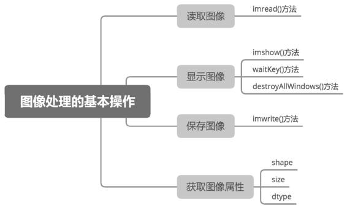

## 图像的基本操作



（1）图像读取

```python
image = cv2.imread(filename, flags)
```

image：imread()方法的返回值，返回的是读取到的图像。

filename：要读取的图像的完整文件名。例如，要读取当前项目目录下的3.1.jpg，filename的值为"3.1.jpg"（双引号是英文格式的）。

flags:读取图像颜色类型的标记。当flags的默认值为1时，表示读取的是彩色图像，此时的flags值可以省略；当flags的值为0时，表示读取的是灰度图像（如果读取的是彩色图像，也将转换为与彩色图像对应的灰度图像）。

（2）图像展示

```python
cv2.imshow(winname, mat)
```

winname：显示图像的窗口名称。

mat：要显示的图像。

（3）aitKey()方法用于等待用户按下键盘上按键的时间。当用户按下键盘上的任意按键时，将执行waitKey()方法，并且获取waitKey()方法的返回值。其语法格式如下：

```python
retval = cv2.waitKey(delay)
```

retval：与被按下的按键对应的ASCII码。例如，Esc键的ASCII码是27，当用户按Esc键时，waitKey()方法的返回值是27。如果没有按键被按下，waitKey()方法的返回值是-1。

delay：等待用户按下键盘上按键的时间，单位为毫秒（ms）。当delay的值为负数、0或者空时，表示无限等待用户按下键盘上按键的时间。

（4）destroyAllWindows()方法用于销毁所有正在显示图像的窗口，其语法格式如下：

```python
     cv2.destroyAllWindows()
```

（5）图像保存

```python
   cv2.imwrite(filename, img)
```

参数说明：

filename：保存图像时所用的完整路径。

img：要保存的图像。

(6)图像拼接

6.1水平拼接数组

hstack()方法可以对数组进行水平拼接（或叫横向拼接），其语法如下：

```
array = numpy.hstack(tup)
```

参数说明：

tup：要拼接的数组元组。

返回值说明：

array：将参数元组中的数组水平拼接后生成的新数组。

hstack()方法可以拼接多个数组，被拼接的数组必须在每一个维度都具有相同的长度，也就是数组“形状相同”.

6.2垂直拼接数组

vstack()方法可以对数组进行垂直拼接（或叫纵向拼接），其语法如下：

```
array = numpy.vstack(tup)
```

参数说明：

tup：要拼接的数组元组。

返回值说明：

array：将参数元组中的数组垂直拼接后生成的新数组。

vstack()方法可以拼接多个数组。被拼接的数组的格式要求与hstack()方法相同。

（7）转换图像色彩空间的cvtColor()方法

```
dst = cv2.cvtColor(src, code)

```

参数说明：

dst：转换后的图像。

src：转换前的初始图像。

code：色彩空间转换码。

> 当图像从BGR色彩空间转换到GRAY色彩空间时，常用的色彩空间转换码是cv2.COLOR_BGR2GRAY。OpenCV也提供了cv2.COLOR_GRAY2BGR（从GRAY色彩空间转换到BGR色彩空间）和cv2.COLOR_ BGR2GRAY（从BGR色彩空间转换到GRAY色彩空间）2个色彩空间转换码。

(8)HSV色彩空间

当图像在BGR色彩空间和HSV色彩空间之间转换时，常用的色彩空间转换码是cv2.COLOR_BGR2HSV和cv2.COLOR_HSV2BGR。

(8)拆分通道

**1．拆分一幅BGR图像中的通道**

当使用split()方法拆分一幅BGR图像中的通道时，split()方法的语法如下：

```
     b, g, r = cv2.split(bgr_image)

```

参数说明：

　b：B通道图像。

　g：G通道图像。

　r：R通道图像。

　bgr_image：一幅BGR图像。

**2．拆分一幅HSV图像中的通道**

当使用split()方法拆分一幅HSV图像中的通道时，split()方法的语法如下：

```
   h, s, v = cv2.split(hsv_image)
```

参数说明：

　h：H通道图像。

　s：S通道图像。

　v：V通道图像。

　hsv_image：一幅HSV图像。