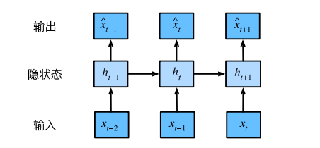

# 循环神经网络

## 序列模型

* 在时间$t$观察到$x_t$，那么得到$T$个不独立的随机变量$(x_1,...x_T)$~$p(X)$
* 使用条件概率展开$p(a,b)=p(a)p(b|a)=p(b)p(a|b)$

### 自回归模型

输⼊数据的数量，输⼊$x_{t−1}, . . . , x_1$本⾝因$t$⽽异。也就是说，输⼊数据的数量这个数字将会随着我们遇到的数据量的增加⽽增加，因此需要⼀个近似⽅法来使这个计算变得容易处理。

第⼀种策略，假设在现实情况下相当⻓的序列$x_{t−1}, . . . , x_1$可能是不必要的，因此我们只需要满⾜某个⻓度
为$τ$的时间跨度，即使⽤观测序列$x_{t−1}, . . . , x_{t−τ}$。当下获得的最直接的好处就是参数的数量总是不变的，⾄少在$t > τ$时如此，这就使我们能够训练⼀个上⾯提及的深度⽹络。这种模型被称为⾃回归模型（autoregressive
models），因为它们是对⾃⼰执⾏回归。

第⼆种策略，是保留⼀些对过去观测的总结$h_t$，并且同时更新预测$\overset{ˆ}{x}_t$和总结$h_t$。这就产⽣了基于$\overset{ˆ}{x}_t= P(x_t|h_t)$估计$x_t$，以及公式$h_t = g(h_{t−1}, x_{t−1})$更新的模型。由于$h_t$从未被观测到，这类模型也被称为隐变量⾃回归模型。

⼀个常⻅的假设是虽然特定值$x_t$可能会改变，但是序列本⾝的动⼒学不会改变。这样的假设是合理的，因为新的动⼒学⼀定受新的数据影响，⽽我们不可能⽤⽬前所掌握的数据来预测新的动⼒学。统计学家称不变的动⼒学为静⽌的（stationary）。因此，整个序列的估计值都将通过以下的⽅式获得：

$P(x_1,x_2,...,x_t)=\overset{T}{\underset{t=1}{\prod}}p(x_t|x_{t-1}...x_1)$

## 文本预处理

文本预处理步骤：

1.将文本作为字符串加载到内存中

2.将字符串拆分为词元（如单词和字符）

3.建立一个词表，将拆分的词元映射到数字索引。

4.将文本转换为数字索引序列，方便模型操作

### 词表

词元的类型是字符串，⽽模型需要的输⼊是数字，因此这种类型不⽅便模型使⽤。现在，让我们构建⼀个字 典，通常也叫做词表（vocabulary），⽤来将字符串类型的词元映射到从0开始的数字索引中。我们先将训练集中的所有⽂档合并在⼀起，对它们的唯⼀词元进⾏统计，得到的统计结果称之为语料（corpus）。然后根 据每个唯⼀词元的出现频率，为其分配⼀个数字索引。很少出现的词元通常被移除，这可以降低复杂性。另 外，语料库中不存在或已删除的任何词元都将映射到⼀个特定的未知词元“<unk>”。我们可以选择增加⼀个 列表，⽤于保存那些被保留的词元，例如：填充词元（“<pad>”）；序列开始词元（“<bos>”）；序列结束词元 （“<eos>”）。

## 语言模型和数据集

假设⻓度为T的⽂本序列中的词元依次为$x_1, x_2, . . . , x_T$。于是，$x_t$(1 ≤ t ≤ T)可以被认为是⽂本序列在时间步t处的观测或标签。在给定这样的⽂本序列时,语⾔模型（language model）的⽬标是估计序列的联合概率  $P(x_1,x_2,...,x_T)$

只需要⼀次抽取⼀个词元$x_t ∼ P(x_t | x_{t−1}, . . . , x_1)$，⼀个理想的语⾔模型就能够基于模型本⾝⽣成⾃ 然⽂本。

### 学习语言模型

基本概率规则：$P(x_1,x_2,...,x_t)=\overset{T}{\underset{t=1}{\prod}}p(x_t|x_{t-1}...x_1)$

为了训练语⾔模型，我们需要计算单词的概率，以及给定前⾯⼏个单词后出现某个单词的条件概率。这些概 率本质上就是语⾔模型的参数。训练数据集中词的概率可以根据给定词的相对词频来计算。

$P(x_2|x_1)=\frac{n(x_2,x_1)}{n(x_1)}$

不幸的是，由于连续单词的出现频率要低得多，所以估计这类单词正确的概率要困难得多。特别是对于⼀些不常⻅的单词组合，要想 找到⾜够的出现次数来获得准确的估计可能都不容易。⽽对于三个或者更多的单词组合，情况会变得更糟。 许多合理的三个单词组合可能是存在的，但是在数据集中却找不到。除⾮我们提供某种解决⽅案，来将这些 单词组合指定为⾮零计数，否则将⽆法在语⾔模型中使⽤它们。如果数据集很⼩，或者单词⾮常罕⻅，那么 这类单词出现⼀次的机会可能都找不到。

⼀种常⻅的策略是执⾏某种形式的拉普拉斯平滑（Laplace smoothing），具体⽅法是在所有计数中添加⼀个小常量。⽤n表⽰训练集中的单词总数，⽤m表⽰唯⼀单词的数量。此解决⽅案有助于处理单元素问题。

$P(x)=\frac{n(x)+\epsilon_1/m}{n+\epsilon_1}$

$P(x^{'}|x)=\frac{n(x,x^{'})+\epsilon_2P(x^{'})}{n(x)+\epsilon_2}$

$P(x^"|x,x^{'})=\frac{n(x,x^{'},x^{"})+\epsilon_3P(x^")}{n(x,x^{'}+\epsilon_3)}$

其中，$ϵ_1, ϵ_2和ϵ_3$是超参数。以$ϵ_1$为例：当$ϵ_1$ = 0时，不应⽤平滑；当$ϵ_1$接近正⽆穷⼤时，P(x)接近均匀概率分 布1/m。

### ⻢尔可夫模型与n元语法 

在讨论包含深度学习的解决⽅案之前，我们需要了解更多的概念和术语。对⻢尔可夫模型将其应⽤于语⾔建模。如果$$P(x_{t+1} | x_t, . . . , x_1) = P(x_{t+1} | x_t)$$，则序列上的分布满⾜⼀ 阶⻢尔可夫性质。阶数越⾼，对应的依赖关系就越⻓。这种性质推导出了许多可以应⽤于序列建模的近似公式：

$P(x_1, x_2, x_3, x_4) = P(x_1)P(x_2)P(x_3)P(x_4)$

$ P(x_1, x_2, x_3, x_4) = P(x_1)P(x_2 | x_1)P(x_3 | x_2)P(x_4 | x_3)$

$ P(x_1, x_2, x_3, x_4) = P(x_1)P(x_2 | x_1)P(x_3 | x_1, x_2)P(x_4 | x_2, x_3)$

通常，涉及⼀个、两个和三个变量的概率公式分别被称为“⼀元语法”、“⼆元语法”和 “三元语法”模型。

一般情况下，单词的频率满足齐普夫定律，第i个最常用单词频率的概率为$n_i$为：$n_{i}∝\frac{1}{i^{\alpha}}$

等价于$log \ n_i = -\alpha log \ i+c_i$

其中$α$是刻画分布的指数，c是常数。这告诉我们想要通过计数统计和平滑来建模单词是不可⾏的，因为这样建模的结果会大大高估尾部单词的频率，也就是所谓的不常⽤单词。

### 读取长序列模型

由于序列数据本质上是连续的，因此我们在处理数据时需要解决这个问题。当序列变得太⻓⽽不能被模型⼀次性全部处理时，我们可能希望拆分这样的序列⽅便模型读取。在介绍该模型之前，我们看⼀下总体策略。假设我们将使⽤神经⽹络来训练语⾔模型，模型中的⽹络⼀次处理具有预定义⻓度（例如n个时间步）的⼀个⼩批量序列。现在的问题是如何随机⽣成⼀个⼩批量数据的特征和标签以供读取。

⾸先，由于⽂本序列可以是任意⻓的，于是任意⻓的序列可以被我们划分为具有相同时间步数的⼦序列。当训练我们的神经⽹络时，这样的⼩批量⼦序列将被输⼊到模型中。假设⽹络⼀次只处理具有n个时间步的⼦序列。请注意，因为我们可以选择任意偏移量来指⽰初始位置，所以我们有相当⼤的⾃由度。

#### 随机采样

在随机采样中，每个样本都是在原始的⻓序列上任意捕获的⼦序列。在迭代过程中，来⾃两个相邻的、随机的、⼩批量中的⼦序列不⼀定在原始序列上相邻。对于语⾔建模，⽬标是基于到⽬前为⽌我们看到的词元来预测下⼀个词元，因此标签是移位了⼀个词元的原始序列。

#### 顺序分区

在迭代过程中，除了对原始序列可以随机抽样外，我们还可以保证两个相邻的⼩批量中的⼦序列在原始序列 上也是相邻的。这种策略在基于⼩批量的迭代过程中保留了拆分的⼦序列的顺序，因此称为顺序分区。

## 循环神经网络

n元语法模型，其中单词$x_t$在时间步t的条件概率仅取决于前⾯n-1个单词。对于时间步$t − (n − 1)$之前的单词，如果我们想将其可能产⽣的影响合并到$x_t$上，需要增加$n$，然⽽模型参数的数量也会随之呈指数增⻓，因为词表V需要存储$|V|^n$个数字，因此与其将$P(x_t | x_{t−1}, . . . , x_{t−n+1})$模型化，不如使⽤隐变量模型： $P(x_t | x_{t−1}, . . . , x_1) ≈ P(x_t | h_{t−1})$

 其中$h_{t−1}$是隐状态（hidden state），也称为隐藏变量（hidden variable），它存储了到时间步t−1的序列信息。通常，我们可以基于当前输⼊$x_t$和先前隐状态$h_{t−1}$ 来计算时间步t处的任何时间的隐状态：$h_t = f(x_t, h_{t−1})$ 

 对于函数f，隐变量模型不是近似值。毕竟$h_t$是可以仅仅存储到⽬前为⽌观察到的所有数据，然而这样的操作可能会使计算和存储的代价都变得昂贵。

隐藏层和隐状态指的是两个截然不同的概念。如上所述，隐藏层是在从输⼊到输出的路径上（以观测⻆度来理解）的隐藏的层，⽽隐状态则是在给定步骤所做的任何事情（以技术⻆度来定义）的输⼊，并且这些状态只能通过先前时间步的数据来计算。

### 有隐藏状态的隐藏层

有了隐状态后，情况就完全不同了。假设我们在时间步t有小批量输⼊$X_t ∈ R^
{n×d}$。换⾔之，对于n个序列样本的⼩批量，$X_t$的每⼀⾏对应于来⾃该序列的时间步t处的⼀个样本。接下来，⽤$H_t ∈ R
^{n×h}$ 表⽰时间步t的隐藏变量。与多层感知机不同的是，我们在这⾥保存了前⼀个时间步的隐藏变量$H_{t−1}$，并引⼊了⼀个新的权重参数$W_{hh} ∈ R^{h×h}$，来描述如何在当前时间步中使⽤前⼀个时间步的隐藏变量。具体地说，当前时间步隐藏变量由当前时间步的输⼊与前⼀个时间步的隐藏变量⼀起计算得出：
$H_t = ϕ(X_tW_{xh} + H_{t−1}W_{hh} + b_h)$. (8.4.5)
从相邻时间步的隐藏变量$H_t$和 $H_{t−1}$之间的关系可知，这些变量捕获并保留了序列直到其当前时间步的历史信息，就如当前时间步下神经⽹络的状态或记忆，因此这样的隐藏变量被称为隐状态（hidden state）。由于在当前时间步中，隐状态使⽤的定义与前⼀个时间步中使⽤的定义相同，因此 计算是循环的（recurrent）。于是基于循环计算的隐状态神经⽹络被命名为循环神经⽹络（recurrent neural network)。在循环神经⽹络中执⾏循环计算的层称为循环层（recurrent layer）。
对于时间步t，输出层的输出类似于多层感知机中的计算：
$O_t = H_tW_{hq} + b_q$.
循环神经⽹络的参数包括隐藏层的权重 $W_{xh} ∈R^{d×h}, W_{hh} ∈ R^{h×h}$和偏置$b_h∈R_{1×h}$，以及输出层的权重$W_{hq}∈R^{h×q}$ 和偏置$b_q∈R^{1×q}$。值得⼀提的是,即使在不同的时间步，循环神经⽹络也总是使⽤这些模型参数。因此，循环神经⽹络的参数开销不会随着时间步的增加⽽增加。

展⽰了循环神经⽹络在三个相邻时间步的计算逻辑。在任意时间步t，隐状态的计算可以被视为：

1. 拼接当前时间步t的输⼊$X_t$和前⼀时间步t−1的隐状态$H_{t−1}$；
2. 将拼接的结果送⼊带有激活函数ϕ的全连接层。全连接层的输出是当前时间步t的隐状态$H_t$。
### 基于循环神经网络的字符级模型

在训练过程中，我们对每个时间步的输出层的输出进⾏softmax操作，然后利⽤交叉熵损失计算模型输出和标签之间的误差。我们使⽤的批量大小为n > 1，每个词元都由⼀个d维向量表⽰。因此，在时间步t输⼊$X_t$将是⼀ 个$n × d$矩阵.

### 困惑度

我们可以通过计算序列的似然概率来度量模型的质量。

如果想要压缩⽂本，我们可以根据当前词元集预测的下⼀个词元。⼀个更好的语⾔模型应该能让我们更准确地预测下⼀个词元。因此，它应该允许我们在压缩序列时花费 更少的⽐特。所以我们可以通过⼀个序列中所有的n个词元的交叉熵损失的平均值来衡量：$\frac{1}{n}\sum_{t=1}^{n}-logP(x_t|x_{t-1},...,x_1)$

其中P由语⾔模型给出，$x_t$是在时间步t从该序列中观察到的实际词元。这使得不同⻓度的⽂档的性能具有了 可⽐性。由于历史原因，⾃然语⾔处理的科学家更喜欢使⽤⼀个叫做困惑度（perplexity）的量为$exp(-\frac{1}{n}\sum_{t=1}^{n}log P(x_t|x_{t-1,...,x_1}))$

困惑度的最好的理解是“下⼀个词元的实际选择数的调和平均数”。

 • 在最好的情况下，模型总是完美地估计标签词元的概率为1。在这种情况下，模型的困惑度为1。 

• 在最坏的情况下，模型总是预测标签词元的概率为0。在这种情况下，困惑度是正⽆穷⼤。

 • 在基线上，该模型的预测是词表的所有可⽤词元上的均匀分布。在这种情况下，困惑度等于词表中唯⼀ 词元的数量。事实上，如果我们在没有任何压缩的情况下存储序列，这将是我们能做的最好的编码⽅式。因此，这种⽅式提供了⼀个重要的上限，⽽任何实际模型都必须超越这个上限。

## 通过时间反向传播

### 梯度剪裁

对于⻓度为T的序列，我们在迭代中计算这T个时间步上的梯度，将会在反向传播过程中产⽣⻓度为O(T)的矩阵乘法链。当T较⼤时，它可能导致数值不稳定，例如可能导致梯度爆炸或梯度消失。因此， 循环神经⽹络模型往往需要额外的⽅式来⽀持稳定训练。 

⼀般来说，当解决优化问题时，我们对模型参数采⽤更新步骤。假定在向量形式的x中，或者在⼩批量数据的负梯度g⽅向上。例如，使⽤η > 0作为学习率时，在⼀次迭代中，我们将x更新为$x − ηg$。如果我们进⼀步假设⽬标函数f表现良好，即函数f在常数L下是利普希茨连续的（Lipschitz continuous）。也就是说，对于任意x和y我们有：$|f(x) − f(y)| ≤ L∥x − y∥$

在这种情况下，我们可以安全地假设：如果我们通过ηg更新参数向量，则 $|f(x) − f(x − ηg)| ≤ Lη∥g∥,$

这意味着我们不会观察到超过$Lη∥g∥$的变化。这既是坏事也是好事。坏的⽅⾯，它限制了取得进展的速度；好的⽅⾯，它限制了事情变糟的程度，尤其当我们朝着错误的⽅向前进时。 有时梯度可能很⼤，从⽽优化算法可能⽆法收敛。我们可以通过降低η的学习率来解决这个问题

⼀个流⾏的替代⽅案是通过将梯度g投影回给定半径的球来裁剪梯度g。

 $g ← min ( 1, \frac{θ}{ ∥g∥} ) g$

 通过这样做，我们知道梯度范数永远不会超过θ，并且更新后的梯度完全与g的原始⽅向对⻬。它还有⼀个值得拥有的副作⽤，即限制任何给定的⼩批量数据（以及其中任何给定的样本）对参数向量的影响，这赋予了模型⼀定程度的稳定性。梯度裁剪提供了⼀个快速修复梯度爆炸的⽅法，虽然它并不能完全解决问题，但它是众多有效的技术之⼀。

### 循环神经网络的梯度分析

在这个简化模型中，我们将时间步t的隐状态表⽰为$h_t$，输⼊表⽰为$x_t$，输出表⽰为$o_t$。使⽤$w_h$和$w_o$来表⽰隐藏层和输出层的权重。每个时间步的隐状态和输出可以写为：$h_t = f(x_t, h_{t−1}, w_h), o_t = g(h_t, w_o)$

其中f和g分别是隐藏层和输出层的变换。因此，我们有⼀个链 ${. . . ,(x_{t−1}, h_{t−1}, o_{t−1}),(x_t, h_t, o_t), . . .}$，它们通过循环计算彼此依赖。前向传播相当简单,⼀次⼀个时间步的遍历三元组$(x_t, h_t, o_t)$，然后通过⼀个⽬标函数在所有T个时间步内评估输出$o_t$和对应的标签$y_t$之间的差异：

 $L(x_1,...,x_T,y_1,...,y_T,w_h, w_o) =\frac{1}{T}  ∑^T_{t=1} l(y_t, o_t)$

对于反向传播，特别是当我们计算⽬标函数L关于参数$w_h$的梯度时。具体来说，按照链式法则：

$\frac { ∂L}{∂w_h} =\frac{1}{T}∑^T_{t=1}\frac{∂l(y_t, o_t)}{∂w_h}=\frac{1}{T}∑ ^T_{t=1}\frac{∂l(y_t, o_t)}{∂o_t }\frac{∂g(h_t, w_o)}{∂h_t}\frac{∂h_t}{∂w_h}$ 

乘积的第⼀项和第⼆项很容易计算，⽽第三项$\frac{∂h_t}{∂w_h}$是使事情变得棘⼿的地⽅，因为我们需要 循环地计算参数$w_h$对$h_t$的影响。根据递归计算，$h_t$既依赖于$h_{t−1}$⼜依赖于$w_h$，其中$h_{t−1}$的计算也依赖于$w_h$。因此，使⽤链式法则产⽣： 

$$\frac{∂ht}{∂w_h} =\frac {∂f(x_t, ht−1, w_h) }{∂w_h} + \frac{∂f(x_t, h_{t−1}, w_h)}{∂ht−1}\frac{∂h_{t−1}}{∂w_h}$$

为了导出上述梯度，假设我们有三个序列${a_t}, {b_t}, {c_t}$，当t = 1, 2, . . .时，序列满⾜$a_0 = 0$且$$a_t = b_t +c_ta_{t−1}$$。 对于t ≥ 1，就很容易得出： 

$a_t = b_t + ∑^{t−1}_{ i=1} (∏^t_{j=i+1} c_j) b_i $

基于下列公式替换$a_t、b_t和c_t$：

$$a_t =\frac{∂ht}{∂wh}$$

 $$b_t =\frac{∂f(x_t, h_{t−1}, w_h)}{∂wh} $$

$$c_t =\frac{ ∂f(x_t, h_{t−1}, w_h)}{∂h_{t−1}} $$

利用循环计算得到

 $\frac{∂h_t}{∂w_h}= \frac{∂f(x_t, h_{t−1}, w_h)}{ ∂w_h} + ∑^{t−1}_{ i=1}(∏^{t}_{j=i+1}\frac{∂f(x_j , h_{j−1}, w_h)} {∂h_{j−1}})\frac{∂f(x_i , h_{i−1}, w_h) }{∂w_h}$

虽然我们可以使⽤链式法则递归地计算$$\frac{∂h_t}{∂w_h}$$，但当t很⼤时这个链就会变得很⻓。

#### 完全计算

完全计算 显然，我们可以仅仅计算$\frac{h_t}{w_h}$中的全部总和，然⽽，这样的计算⾮常缓慢，并且可能会发⽣梯度爆炸，因为初始条件的微⼩变化就可能会对结果产⽣巨⼤的影响。也就是说，我们可以观察到类似于蝴蝶效应的现象， 即初始条件的很⼩变化就会导致结果发⽣不成⽐例的变化。这对于我们想要估计的模型⽽⾔是⾮常不可取的。毕竟，我们正在寻找的是能够很好地泛化⾼稳定性模型的估计器。因此，在实践中,这种⽅法⼏乎从未使⽤过。 

#### 截断时间步 

或者，我们可以在$$τ$$步后截断中$\frac{h_t}{w_h}$的求和计算。这会带来真实梯度的近似，只需将求和终⽌为$$∂h_{t−τ} /∂w_h$$。在实践中，这种⽅式⼯作得很好。它 通常被称为截断的通过时间反向传播 。这样做导致该模型主要侧重于短期影响，⽽不是⻓期影 响。这在现实中是可取的，因为它会将估计值偏向更简单和更稳定的模型。

#### 随机截断

最后，可以⽤⼀个随机变量替换$$\frac{∂ht}{∂wh}$$，该随机变量在预期中是正确的，但是会截断序列。这个随机变量是通过使⽤序列$ξ_t$来实现的，序列预定义了0 ≤ πt ≤ 1，其中$P(ξ_t = 0) = 1 − π_t$且$P(ξ_t = π^{−1}_ t ) = π_t$，因此E[ξt] = 1。我们使⽤它来替换 梯度$\frac{∂h_t}{∂w_h}$得到：

$$z_t =\frac{∂f(x_t, h_{t−1}, w_h)}{∂w_h}+ξ_t\frac{∂f(x_t, h_{t−1}, w_h)}{∂h_{t−1}}\frac{ ∂h_{t−1}}{ ∂w_h}$$ 

 从$ξ_t$的定义中推导出来$$E[zt] = \frac{∂ht}{∂wh}$$。每当$ξ_t$ = 0时，递归计算终止在这个t时间步。这导致了不同⻓度序列的加权和，其中⻓序列出现的很少，所以将适当地加⼤权重。

