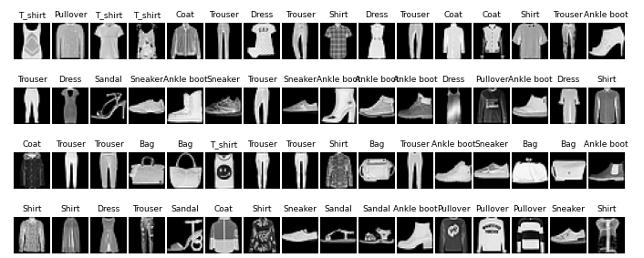
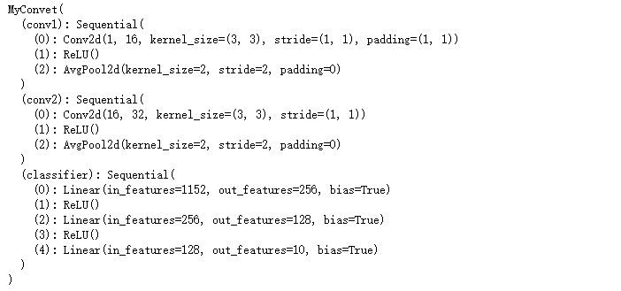
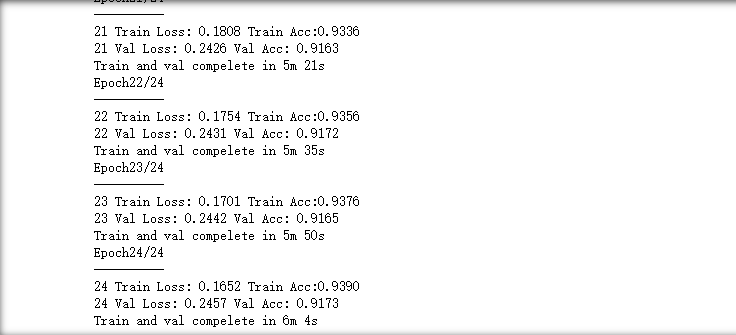
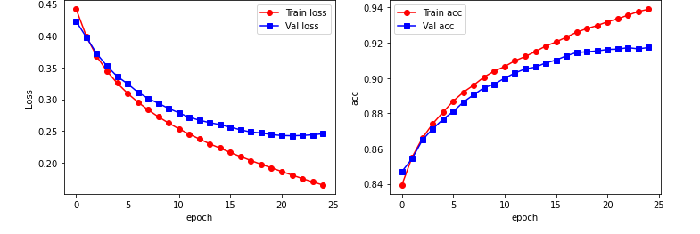

# 卷积神经网络

## CNN的结构

图像$\rightarrow$卷积层$\rightarrow$池化层$\rightarrow$全连接层$\rightarrow$输出

### 卷积层

卷积：通过对图像进行卷积运算，对图像的某个特诊进行选择性地增强或者减弱。

卷积层中使用多个过滤器对输入图像的特征进行侦测。图像的值对应的是该点的颜色。

通道数：在一般的图像数据中，每个颜色都包含RGB三种颜色。一副图像的张数称为通道数。过滤器与输入图像有相同数量的通道。

偏置：每个过滤器都对应一个偏置。

### 池化层

池化：池化层负责将图像的各个区域进行划分，并将各个区域的代表特征抽取出来，重新排列组合成一副新图像。

每个区域的最大值被作为代表此区域的值。这种池化的方法被称为最大池化。

### 全连接层

全连接层是指普通的神经网络中所使用的网络层。

卷积层和池化层的输出被传递到全连接层的输入时，图像被转化成平坦的向量。

### 填充

在卷积层和池化层中，将输入的图像包围在中心进行设置的处理方法被称为填充。

经过填充处理之后，图像的尺寸就变大了，填充的目的:确保经过卷积处理的图像大小能保持不变。卷积运算的特征决定了对图像边缘的卷积运算次数比较少，而经过填充后的边缘数据能够更多地参与卷积运算，因此进行填充能够更多地获取图像边缘的特征。

### 步长

步长：在卷积运算中，步长指过滤器每次移动的间隔距离。（步长一般设置为1）

输入图像的尺寸$I_h×I_w$，过滤器尺寸为$F_h×F_w$，填充的幅度为$D$，步长大小为$S$,则得到的输出图像的高度为$O_h$和$O_w$。

$O_h=\frac{I_h-F_h+2D}{S}+1$

$O_w=\frac{I_w-F_w+2D}{S}+1$

## CNN的学习

| 网络层  | 误差的传播 | 参与学习的参数 |
| ---- | ----- | ------- |
| 卷积层  | 是     | 过滤器，偏置  |
| 池化层  | 是     | 无       |
| 全连接层 | 是     | 权重，偏置   |

## 卷积神经网络的实战

通过CNN分类识别Fashion—MNIST数据集。

### 库函数的引入

```python
import numpy  as np
import pandas as pd
from sklearn.metrics import accuracy_score,confusion_matrix,classification_report
import matplotlib.pyplot as plt
import seaborn as sns
import copy
import time
import torch
import torch.nn as nn
from torch.optim import Adam
import torch.utils.data as Data
from torchvision import transforms
from torchvision.datasets import FashionMNIST
```

### 数据集的下载与展示

```python
train_data = FashionMNIST(
    root = "./data/FashionMNIST",
    train = True,
    transform = transforms.ToTensor(),
    download = False
)
train_loader = Data.DataLoader(
    dataset = train_data,
    batch_size = 64,
    shuffle = False,
    num_workers = 2,
)
print("train_loader的batch数量为：",len(train_loader))  ## 938
for step,(b_x,b_y) in enumerate(train_loader):
    if step > 0:
        break
batch_x = b_x.squeeze().numpy()
batch_y = b_y.numpy()
class_label = train_data.classes
class_label[0] = "T_shirt"
plt.figure(figsize = (12,5))
for ii in np.arange(len(batch_y)):
    plt.subplot(4,16,ii+1)
    plt.imshow(batch_x[ii,:,:],cmap = plt.cm.gray)
    plt.title(class_label[batch_y[ii]],size = 9)
    plt.axis("off")
    plt.subplots_adjust(wspace = 0.05) # wspace 左右的距离
```



### 数据的预处理与神经网络的定义

```python
test_data = FashionMNIST(
    root = "./data/FashionMNIST",
    train = False,
    download = False,
)
test_data_x = test_data.data.type(torch.FloatTensor)/255.0
test_data_x = torch.unsqueeze(test_data_x,dim = 1)
test_data_y = test_data.targets
print("test_data_x.shape:",test_data_x.shape) #test_data_x.shape: torch.Size([10000, 1, 28, 28])
print("test_data_y.shape:",test_data_y.shape) #test_data_y.shape: torch.Size([10000])
class MyConvet(nn.Module):
    def __init__(self):
        super(MyConvet,self).__init__()
        self.conv1 = nn.Sequential(
            nn.Conv2d(
                in_channels = 1,
                out_channels = 16,
                kernel_size = 3,
                stride = 1,
                padding = 1,
            ),
            nn.ReLU(),
            nn.AvgPool2d(
                kernel_size = 2,
                stride = 2,
            ),
        )
        self.conv2 = nn.Sequential(
            nn.Conv2d(16,32,3,1,0),
            nn.ReLU(),
            nn.AvgPool2d(2,2),
        )
        self.classifier = nn.Sequential(
            nn.Linear(32*6*6,256),
            nn.ReLU(),
            nn.Linear(256,128),
            nn.ReLU(),
            nn.Linear(128,10)
        )
    def forward(self,x):
        x = self.conv1(x)
        x = self.conv2(x)
        x = x.view(x.size(0),-1)
        output = self.classifier(x)
        return output

myconvet = MyConvet().to(device)
print(myconvet)
```



```python
def train_model(model,traindataloader,train_rate,criterion,optimizer,num_epochs=25):
    batch_num = len(traindataloader)
    train_batch_num = round(batch_num * train_rate)   # round()返回四舍五入值
    best_model_wts = copy.deepcopy(model.state_dict())  
    #state_dict变量存放训练过程中需要学习的权重和偏执系数
    best_acc = 0.0
    train_loss_all = []
    train_acc_all =[]
    val_loss_all = []
    val_acc_all = []
    since = time.time()                                   #time.time() 返回当前时间的时间戳
    for epoch in range(num_epochs):
        print('Epoch{}/{}'.format(epoch+1,num_epochs + 1))
        print('-'*10)
        train_loss = 0.0
        train_corrects = 0
        train_num = 0
        val_loss = 0.0
        val_corrects = 0
        val_num = 0
        for step,(b_x,b_y)in enumerate(traindataloader):
            if step < train_batch_num:
                model.train()
                output = model(b_x)
                pre_lab = torch.argmax(output,1)
                loss = criterion(output, b_y)
                optimizer.zero_grad()
                loss.backward()
                optimizer.step()
                train_loss += loss.item() * b_x.size(0)
                train_corrects += torch.sum(pre_lab ==b_y.data)
                train_num += b_x.size(0)
            else:
                model.eval()
                output = model(b_x)
                pre_lab = torch.argmax(output,1)
                loss = criterion(output,b_y)
                val_loss += loss.item() * b_x.size(0)
                val_corrects += torch.sum(pre_lab ==b_y.data)
                val_num += b_x.size(0)
        train_loss_all.append(train_loss/train_num)
        train_acc_all.append(train_corrects.double().item()/train_num)
        val_loss_all.append(val_loss/val_num)
        val_acc_all.append(val_corrects.double().item()/val_num)
        print('{} Train Loss: {:.4f} Train Acc:{:.4f}'.format(epoch,train_loss_all[-1],train_acc_all[-1]))
        print('{} Val Loss: {:.4f} Val Acc: {:.4f}'.format(epoch,val_loss_all[-1],val_acc_all[-1]))
        if val_acc_all[-1] > best_acc:
            best_acc = val_acc_all[-1]
            best_model_wts = copy.deepcopy(model.state_dict())
        time_use = time.time() -since
        print("Train and val compelete in {:.0f}m {:.0f}s".format(time_use//60,time_use%60))
    model.load_state_dict(best_model_wts)
    train_process = pd.DataFrame(
        data={"epoch":range(num_epochs),
              "train_loss_all":train_loss_all,
              "val_loss_all":val_loss_all,
             "train_acc_all":train_acc_all,
             "val_acc_all":val_acc_all})
    return model,train_process
optimizer = torch.optim.Adam(myconvet.parameters(),lr = 0.0003)  # 优化器
criterion = nn.CrossEntropyLoss()                                # 损失函数
myconvet,train_process = train_model(myconvet,train_loader,0.8,criterion,optimizer,num_epochs=25)# 模型的训练
```

### 最终的结果与图像





